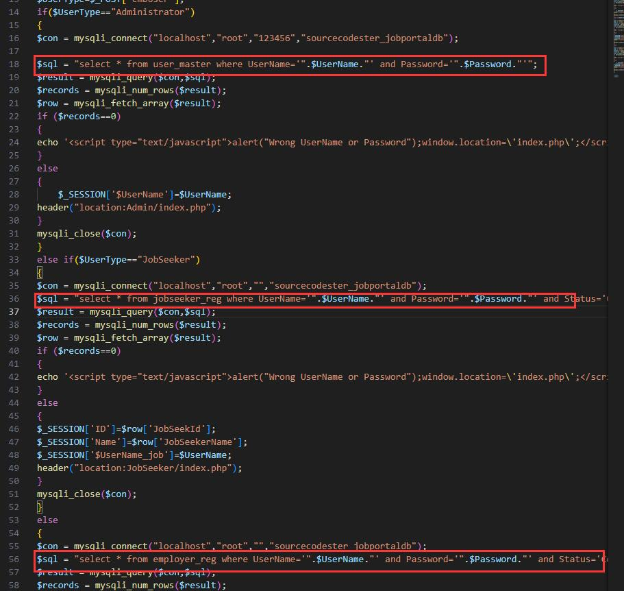
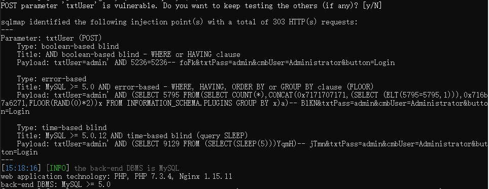

# SQL Injection in `Online Job Portal in PHP`
Source code: https://www.sourcecodester.com/php/14518/online-job-portal-php-full-source-code-2020.html

## Code Audit

In `login.php`, the code is vulnerable to SQL injection in the `txtUser` parameter.

## Result of Sqlmap

